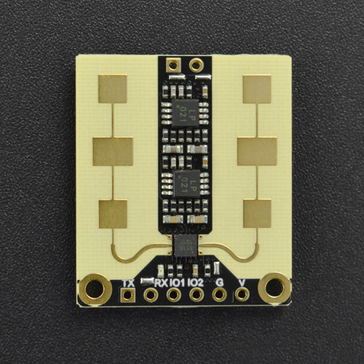

# DFRobot_C4001
- [English Version](./README.md)

这是一款人体存在传感器，如PIR传感器、红外传感器和超声波传感器，具有动静都能检测的特点，并且其抗干扰能力相对较强，不易受到温度变化、环境光变化和环境噪声等因素的影响。不论人体是静坐、睡觉还是运动，传感器都能够快速、灵敏地检测到其存在。
例如，在公共智能厕所项目中，由于公共厕所环境相对复杂，容易受到环境噪声和温湿度变化的影响。然而，该款毫米波人体存在传感器可以在这种复杂的环境下实时监测公共厕所蹲位的使用情况，优化公共厕所的布局和资源分配，提高使用效率和用户体验。




## 产品链接(https://www.dfrobot.com.cn/goods-3115.html)

    SKU：SEN0609   SEN0610

## 目录

* [概述](#概述)
* [库安装](#库安装)
* [方法](#方法)
* [兼容性](#兼容性)
* [历史](#历史)
* [创作者](#创作者)

## 概述

提供一个python库给模块，此库具有以下功能：
  获取 物体是否存在
  获取 物体的速度，范围，物体能量强度

## 库安装
1. 下载库至树莓派，要使用这个库，首先要将库下载到Raspberry Pi，命令下载方法如下:

```
sudo git clone https://github.com/DFRobot/DFRobot_C4001
```

1. 打开并运行例程，要执行一个例程demo_x.py，请在命令行中输入python demo_x.py。例如，要执行 motion_range_velocity.py例程，你需要输入:

```
python  motion_range_velocity.py
或 
python2 motion_range_velocity.py
或 
python3 motion_range_velocity.py
```

## 方法

```python
  def begin(self):
  '''!
    @brief begin 
  '''

  def get_status(self):
  '''!
    @brief get_status
    @return status
  '''

  def motion_detection(self):
  '''!
    @brief motion_detection
    @n     检测物体是否运动
    @return status
    @retval 0 物体没有运动
    @retval 1 物体运动
  '''

  def set_sensor_mode(self, mode):
  '''!
    @brief set_sensor_mode
    @param mode 
    @n  SPEED_MODE  速度模式
    @n  EXIST_MODE  存在模式
  '''

  def set_trig_sensitivity(self, sensitivity):
  '''!
    @brief set_trig_sensitivity
    @param sensitivity 0-9
  '''
    
  def get_trig_sensitivity(self):
  '''!
    @brief get_trig_sensitivity
    @return sensitivity 0-9
  '''

  def set_keep_sensitivity(self, sensitivity):
  '''!
    @brief set_keep_sensitivity
    @param sensitivity 0-9
  '''

  def get_keep_sensitivity(self):
  '''!
    @brief get_keep_sensitivity
    @return sensitivity 0-9
  '''

  def set_delay(self, trig, keep):
  '''!
    @brief set_delay
    @param trig (0-200) 单位10ms范围(0 ~200)(0s-2.0)
    @param keep (4~3000) (2s-1500s)
  '''

  def get_trig_delay(self):
  '''!
    @brief get_trig_delay
    @return trig
  '''
    
  def get_keep_timerout(self):
  '''!
    @brief get_keep_timerout
    @return keep timerout
  '''

  def set_detection_range(self, min, max):
  '''!
    @brief set_detection_range
    @param min (30-2000)
    @param max (240~2000)
    @n min不大于max，否则函数不正常。
  '''

  def get_trig_range(self):
  '''!
    @brief get_trig_range
    @return trig range
  '''

  def get_max_range(self):
  '''!
    @brief get_max_range
    @return max range
  '''

  def get_min_range(self):
  '''!
    @brief get_max_range
    @return min range
  '''

  def get_target_number(self):
  '''!
    @brief get_target_number
    @return target number 
  '''

  def get_target_speed(self):
  '''!
    @brief get_target_speed
    @return target speed
  '''

  def get_target_range(self):
  '''!
    @brief get_target_range
    @return target range
  '''

  def get_target_energy(self):
  '''!
    @brief get_target_energy
    @return target energy
  '''

  def set_detect_thres(self, min, max, thres):
  '''!
    @brief set_detect_thres
    @param min 0-2500
    @param max 0-2500
    @param thres 0-65535
  '''

  def set_io_polaity(self, value):
  '''!
    @brief set_io_polaity
    @param value 0 or 1
    @n 0:有目标时输出低，无目标时输出高
    @n 1:有目标时输出高，无目标时输出低(默认状态)
  '''

  def get_io_polaity(self):
  '''!
    @brief get_io_polaity
    @return io status
  '''

  def set_pwm(self, pwm1, pwm2, timer):
  '''!
    @brief set_pwm
    @param pwm1  未检测到目标时OUT引脚输出信号的占空比。取值范围是0 ~ 100
    @param pwm2  检测到目标后OUT引脚输出信号的占空比。取值范围是0 ~ 100
    @param timer pwm1占空比到pwm2占空比的时间。取值范围为0 ~ 255，对应的时间值= timer*64ms
    @n     例如timer=20，占空比从pwm1到pwm2需要20*64ms=1.28s。
  '''

  def get_pwm(self):
  '''!
    @brief get_pwm
    @return pwm value
  '''
    
  def get_tmin_range(self):
  '''!
    @brief get_tmin_range
    @return speed mode min range
  '''

  def get_tmax_range(self):
  '''!
    @brief get_tmax_range
    @return speed mode max range
  '''

  def get_thres_range(self):
  '''!
    @brief get_thres_range
    @return speed mode thres range
  '''
    
  def set_fretting_detection(self, status):
  '''!
    @brief set_fretting_detection
    @param status
    @n    FRETTING_ON  开启微动检测
    @n    FRETTING_OFF 关闭微动检测
  '''
    
  def get_fretting_detection(self):
  '''!
    @brief get_fretting_detection
    @return status
  '''
```

## 兼容性

* RaspberryPi Version

| Board        | 正常运行  | 运行失败   | 未测试    | 备注
| ------------ | :-------: | :--------: | :------: | :-----: |
| RaspberryPi2 |           |            |    √     |         |
| RaspberryPi3 |           |            |    √     |         |
| RaspberryPi4 |     √     |            |          |         |

* Python版本

| Python  | 正常运行  | 运行失败   | 未测试    | 备注
| ------- | :-------: | :--------: | :------: | :-----: |
| Python2 |     √     |            |          |         |
| Python3 |     √     |            |          |         |


## 历史

- 2024/02/26 - V1.0.0 版本

## 创作者

Written by ZhixinLiu(zhixin.liu@dfrobot.com), 2022. (Welcome to our website)